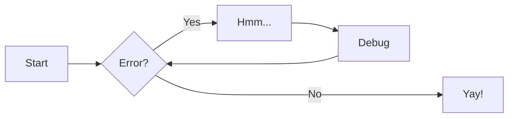

# Get Started

TelemetryDeck uses Zensical. For full documentation visit [zensical.org](https://zensical.org/docs/).

## Document Metadata

All metadata for a documentation page is specified in the YAML header at the top of its markdown file (also called the `front matter` of the document). Most of the metadata is optional, but the `title` is required:

```yaml
---
icon: fontawesome/solid/icons
title: How to write this Documentation
tags:
  - tag 1
  - ...
  - tag n
status: new
---
```

The `title` string is how the page is titled in the left sidebar, at the top of the documentation page and in the "Getting Started" page, should it appear there.

Tags are used to organize documentation pages in the sidebar and to link related pages.

__One tag:__

  ```yaml
  tags: Swift
  ```

__Multiple tags:__

  ```yaml
  tags:
    - Setup
    - Quickstart
    - Code
    - Swift
  ```

Use the `tags` metadata to add additional tags that link articles together, such as

- The type of page (`setup`, `code`)
- The software stack or language (`swiftui`, `android`, `kotlin` etc.)
- The experience level of the reader (`beginner`, `intermediate`, `advanced`)
- The type of query (`filter`, `cohorts`, etc.)

The `status` metadata is used to show the current status of a page. The following status identifiers are already defined:

- :lucide-badge-alert: – `new`: for brand new pages that deserve to stand out
- :lucide-trash: – `deprecated`: for pages that are not up to date anymore but still relevant to keep

### Compatibility and Contribution

The right sidebar contains a list of compatibility information for the documentation page. If `testedOn` is set, it will display the `testedOn` value. In addition, it will show the date when the markdown file for the documentation page was last updated. This gives the reader additional hints as to how outdated or current the page is.

The right sidebar will also display a list of contributors who have written an git commit that touches the specific markdown file. The documentation system will try and retrieve the GitHub avatar images for the contributors by

1. Retrieving the committer email from the git commit
1. Searching for that email in the GitHub API
1. Downloading the avatar image from the GitHub API

This will fail if the email is not found in the GitHub API, or if the email is not set as "public email" in the contributor's GitHub profile.

## Best practices

### Capitalization
We capitalize our Headings in **Sentence Case** (e.g., "This is a heading of our docs").

### Date and Time Format
For date formats we use either:

* International/European date format: `DD/MM/YYYY` (e.g., 01.04.2026)
* ISO 8601: `YYYY-MM-DD` (e.g., 2026-04-01)

For times we use either:

* 24-Hour: `HH:mm:ss` (e.g., 14:30:05)
* 12-Hour: `hh:mm:ss tt` (e.g., 02:30:05 PM). `AM/PM` is capitalized.

## Tables

Tables are supported in markdown. Here is an example:

| Name    | Description                                                                                                        |
| ------- | ------------------------------------------------------------------------------------------------------------------ |
| `title` | The title of the page. This is used in the left sidebar, at the top of the page and in the "Getting Started" page. |

Here is the markdown code for the previous table:

```markdown
| Name    | Description                                                                                                        |
| ------- | ------------------------------------------------------------------------------------------------------------------ |
| `title` | The title of the page. This is used in the left sidebar, at the top of the page and in the "Getting Started" page. |
```

## Formatting

Documentation is written in [Markdown](https://www.markdownguide.org). This means you can write documentation in plain text, and it will be converted to HTML. All standard Markdown elements are supported, such as **bold text**, _italic text_, `inline code`, and [links](https://www.markdownguide.org/basic-syntax/#link).

> Go to [documentation](https://zensical.org/docs/authoring/formatting/)

- ==This was marked (highlight)==
- ^^This was inserted (underline)^^
- ~~This was deleted (strikethrough)~~
- H~2~O
- A^T^A
- ++ctrl+alt+del++

### Icons, Emojis

> Go to [documentation](https://zensical.org/docs/authoring/icons-emojis/)

* :sparkles: `:sparkles:`
* :rocket: `:rocket:`
* :tada: `:tada:`
* :memo: `:memo:`
* :eyes: `:eyes:`

### Unordered lists

* are just
* asteriks or dashes

### Ordered lists

1.  are
1.  just
3.  numbers

Here is the markdown code for the previous paragraphs:

```markdown
All standard Markdown elements are supported,
such as **bold text**, _italic text_, `inline code`,
and [links](https://www.markdownguide.org/basic-syntax/#link).

Unordered lists

* are just
* asteriks or dashes

and ordered lists

1.  are
1.  just
3.  numbers
```

## Images

To display an image in a docs article, add it to the `assets` directory. You can then link it using regular markdown image syntax, adding `/assets/` before the image's name.

Example: You just added the file `privacy-overview.png` to the `assets` folder. You can now display that image like so:

```markdown

```

The first part is the image's alt text. The second part is the path (`/assets/`) and the image file name `privacy-overview.png`.

Here's what it looks like:


!!! warning "Image File Locations"

    Image files need to live in the `assets` directory inside `docs/`. Image files elsewhere in the file hierarchy will be ignored.

    Prefix `/assets/` to the path when linking to the image — the path is resolved against the docs site root.


## Code Blocks

> Go to [documentation](https://zensical.org/docs/authoring/code-blocks/)

Code blocks begin with three backticks (\`) and end with three backticks (\`). On the same line as the opening backticks, you **must** specify the programming language of the code block.

````text
```swift
print("Hello, world!")
```
````

Results in:

```swift
print("Hello, world!")
```

If you can't specify a language, please use `text` instead.

````text
```text
this is
   just
    plain text
```
````

### Content tabs

> Go to [documentation](https://zensical.org/docs/authoring/content-tabs/)

=== "Python"

    ``` python
    print("Hello from Python!")
    ```

=== "Rust"

    ``` rs
    println!("Hello from Rust!");
    ```

## Admonitions

> Go to [documentation](https://zensical.org/docs/authoring/admonitions/)

!!! info
    This is an **info** admonition. Use to provide additional information.

!!! note

    This is a **note** admonition. Use it to provide helpful information.

!!! warning

    This is a **warning** admonition. Be careful!

### Details

> Go to [documentation](https://zensical.org/docs/authoring/admonitions/#collapsible-blocks)

??? info "Click to expand for more info"

    This content is hidden until you click to expand it.
    Great for FAQs or long explanations.

## Buttons

You can use button links to link to especially important pages or resources. Make a button by supplying

- a label
- an URL to link to
- and a CSS class selector to indicate wether the button is a primary button or a secondary button

```markdown
[Subscribe to our newsletter](https://telemetrydeck.com/newsletter/){ .md-button .md-button--primary }
[Subscribe to our newsletter](https://telemetrydeck.com/newsletter/){ .md-button }
```

[Subscribe to our newsletter](https://telemetrydeck.com/newsletter/){ .md-button .md-button--primary }
[Subscribe to our newsletter](https://telemetrydeck.com/newsletter/){ .md-button }

## Diagrams

> Go to [documentation](https://zensical.org/docs/authoring/diagrams/)



## Footnotes

> Go to [documentation](https://zensical.org/docs/authoring/footnotes/)

Here's a sentence with a footnote.[^1]

Hover it, to see a tooltip.

[^1]: This is the footnote.