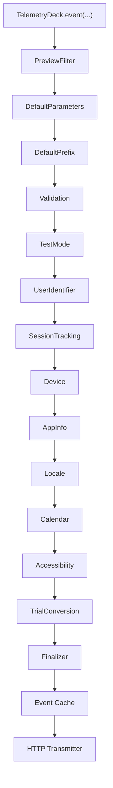

## The processor pipeline

When you call `TelemetryDeck.event(...)`, the event passes through a pipeline of **processors** before transmission. Each processor can inspect, enrich, transform, or filter the event.



Each processor receives two things:

- **EventInput** — the event name, parameters, and optional float value
- **EventContext** — mutable metadata that accumulates as the event moves through the pipeline (session ID, user identifier, test mode flag, and additional parameters)

A processor can modify either of these, then call `next` to pass control to the next processor. It can also throw `ProcessorError.eventFiltered` to silently drop the event.

At the end of the pipeline, the **finalizer** merges everything into a single `Event` object, hashes the user identifier with SHA256, and hands it to the cache for transmission.

## Built-in processors

The SDK ships with a default set of processors. They run in this order:

### PreviewFilterProcessor

Detects Xcode SwiftUI previews and drops all events during preview rendering. You never see preview noise in your dashboard.

### DefaultParametersProcessor

Injects the `defaultParameters` you provided at initialization. These appear on every event. Your per-event parameters override them if keys collide.

### DefaultPrefixProcessor

Prepends the `eventPrefix` to event names and `parameterPrefix` to custom parameter keys. SDK-internal parameters (prefixed with `TelemetryDeck.`) are not affected.

For example, with `eventPrefix: "MyApp."`, calling `event("login")` produces `MyApp.login`.

### ValidationProcessor

Warns in the console if your event names or parameter keys collide with reserved `TelemetryDeck.*` names. Events pass through unchanged.

### TestModeProcessor

Determines whether the event should be marked as test data. In `DEBUG` builds, test mode is on by default. You can override this with the `testMode` parameter during initialization.

### UserIdentifierProcessor

Attaches a user identifier to the event context. The SDK auto-resolves a default identifier per platform (IDFV on iOS, a persisted UUID on macOS). You can override it with `TelemetryDeck.setUserIdentifier(_:)` or pass a `customUserID` per event. See [User Identification](/articles/swift-user-identification/) for full details on resolution order, platform behavior, and hashing.

### SessionTrackingProcessor

Manages session lifecycle and retention metrics. It:

- Generates a session ID at startup
- Starts a new session when the app returns from background after 5+ minutes
- Fires `TelemetryDeck.Session.started` on each new session (configurable)
- Detects first-ever launch and fires `TelemetryDeck.Acquisition.newInstallDetected`
- Adds retention parameters to every event:

| Parameter | Type | Description |
|---|---|---|
| `TelemetryDeck.Retention.totalSessionsCount` | Int | Total sessions across all app launches |
| `TelemetryDeck.Retention.distinctDaysUsed` | Int | Unique calendar days the app was used |
| `TelemetryDeck.Retention.distinctDaysUsedLastMonth` | Int | Unique days used in the last 30 days |
| `TelemetryDeck.Retention.averageSessionSeconds` | Int | Average session length (-1 if only one session) |
| `TelemetryDeck.Retention.previousSessionSeconds` | Int | Length of the previous session (if ≥2 sessions) |
| `TelemetryDeck.Acquisition.firstSessionDate` | String | ISO 8601 date of first session |
| `TelemetryDeck.Acquisition.isNewInstall` | Bool | `true` only on the first event of the first session |

Session history is persisted for 90 days. Older sessions are counted but their details are pruned.

### DeviceProcessor

Adds hardware and platform information:

| Parameter | Example |
|---|---|
| `TelemetryDeck.Device.platform` | `iOS` |
| `TelemetryDeck.Device.operatingSystem` | `iOS` |
| `TelemetryDeck.Device.systemVersion` | `iOS 18.0.0` |
| `TelemetryDeck.Device.systemMajorVersion` | `iOS 18` |
| `TelemetryDeck.Device.systemMajorMinorVersion` | `iOS 18.0` |
| `TelemetryDeck.Device.modelName` | `iPhone16,2` |
| `TelemetryDeck.Device.architecture` | `iPhone16,2` (iOS) / `arm64` (macOS) |
| `TelemetryDeck.Device.timeZone` | `UTC+2` |
| `TelemetryDeck.RunContext.isSimulator` | `false` |
| `TelemetryDeck.RunContext.isDebug` | `true` |
| `TelemetryDeck.RunContext.isTestFlight` | `false` |
| `TelemetryDeck.RunContext.isAppStore` | `false` |
| `TelemetryDeck.RunContext.targetEnvironment` | `native` |

### AppInfoProcessor

Adds app and SDK version information:

| Parameter | Example |
|---|---|
| `TelemetryDeck.AppInfo.version` | `2.1.0` |
| `TelemetryDeck.AppInfo.buildNumber` | `42` |
| `TelemetryDeck.AppInfo.versionAndBuildNumber` | `2.1.0 (build 42)` |
| `TelemetryDeck.SDK.name` | `SwiftSDK` |
| `TelemetryDeck.SDK.version` | `3.0.0` |
| `TelemetryDeck.SDK.nameAndVersion` | `SwiftSDK 3.0.0` |

### LocaleProcessor

Adds language and region preferences:

| Parameter | Example |
|---|---|
| `TelemetryDeck.RunContext.locale` | `en_US` |
| `TelemetryDeck.RunContext.language` | `en` |
| `TelemetryDeck.UserPreference.language` | `de` |
| `TelemetryDeck.UserPreference.region` | `US` |

### CalendarProcessor

Adds temporal context for time-based analysis:

| Parameter | Example |
|---|---|
| `TelemetryDeck.Calendar.dayOfMonth` | `15` |
| `TelemetryDeck.Calendar.dayOfWeek` | `3` |
| `TelemetryDeck.Calendar.dayOfYear` | `166` |
| `TelemetryDeck.Calendar.weekOfYear` | `24` |
| `TelemetryDeck.Calendar.isWeekend` | `false` |
| `TelemetryDeck.Calendar.monthOfYear` | `6` |
| `TelemetryDeck.Calendar.quarterOfYear` | `2` |
| `TelemetryDeck.Calendar.hourOfDay` | `14` |

### AccessibilityProcessor

Captures accessibility settings and display properties. Results are cached for 1 hour to avoid excessive main-thread access.

| Parameter | Example |
|---|---|
| `TelemetryDeck.Accessibility.isBoldTextEnabled` | `false` |
| `TelemetryDeck.Accessibility.isReduceMotionEnabled` | `false` |
| `TelemetryDeck.Accessibility.preferredContentSizeCategory` | `L` |
| `TelemetryDeck.UserPreference.colorScheme` | `Dark` |
| `TelemetryDeck.UserPreference.layoutDirection` | `leftToRight` |
| `TelemetryDeck.Device.screenResolutionWidth` | `430.0` |
| `TelemetryDeck.Device.screenResolutionHeight` | `932.0` |

### TrialConversionProcessor

Available on iOS 15, macCatalyst 15, macOS 12, tvOS 15, and watchOS 8. Monitors StoreKit `Transaction.updates` in the background and automatically fires `TelemetryDeck.Purchase.convertedFromTrial` when a user transitions from a free trial to a paid subscription. No setup required — it runs silently.

## Event caching and transmission

After processing, events land in a persistent cache (up to 10,000 events). The transmitter sends batched events every 10 seconds to `{apiBaseURL}/v2/namespace/{namespace}/`.

If transmission fails, the SDK retries with exponential backoff (doubling the interval, capped at 5 minutes). Events that receive permanent HTTP errors (400, 401, 403, 404, 413, 422, 501, 505) are dropped immediately.

You can force an immediate flush:

```swift
await TelemetryDeck.flush()
```

## Pre-initialization buffering

Events sent before `initialize()` completes are buffered in memory and replayed once initialization finishes. Event ordering is preserved.
